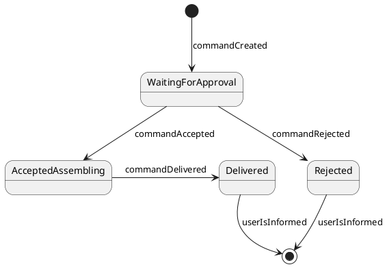
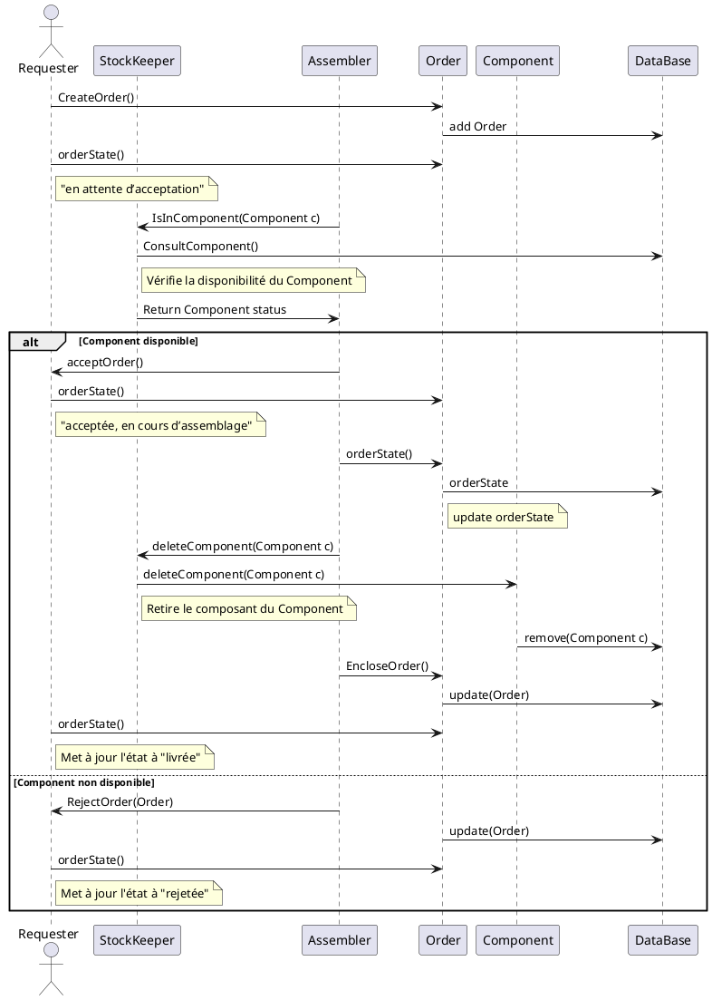

# uOttawa - 2024-2025 - SEG2505A - Projet - Groupe 16

**Nom du projet** : Service à la demande de PC sur mesure

## Membres du projet

| Prénom        | NOM           | Identifiant GitHub |
| ------------- | ------------- | ------------------ |
| Salma         | Sajid         | sjSalma            |
| Mohamed       | El Guellaa    | Simo-elgu          |
| Sami          | Amara         | SamiAmara0         |

## Introduction
Ce projet s’inscrit dans le cadre du cours SEG2505 - Projet de l’Université d’Ottawa. L’objectif principal est de concevoir, développer, et documenter une application Android autonome permettant de gérer un service interne de commande de PC sur mesure.

L’application doit répondre aux besoins de différents types d’utilisateurs (administrateur, magasinier, assembleur, et demandeur) et respecter les exigences explicites et implicites mentionnées dans le cahier des charges. Ce projet vise également à démontrer les compétences en génie logiciel, notamment :

- La capacité à analyser des besoins et les traduire en exigences formelles.
- La modélisation et la documentation des systèmes avec des diagrammes UML.
- Le développement de solutions logicielles robustes et innovantes dans des délais fixés.
- La collaboration efficace au sein d’une équipe pour atteindre des objectifs communs.

## Clarifications sur les exigences

### Exigences explicites reformulées
- L'application doit fournir une interface utilisateur disponible en français ou en anglais au choix ou les deux ;
- L'application doit prévoir un utilisateur prédéfini pour chacun des staff suivants : "Administrator", "StoreKeeper" et "Assembler" ;
- Chacun des staff doit avoir un mot de passe stocké dans la base de données lors de l'initialisation ;
- Le système doit permettre la création de plusieurs utilisateurs ayant le rôle "Requester" ;
- Chaque utilisateur doit être identifié par une adresse électronique unique et un mot de passe obligatoires ;
- L'administrateur doit pouvoir ajouter des utilisateurs ayant le rôle "Requester" ;
- L'administrateur doit pouvoir modifier des utilisateurs ayant le rôle "Requester" ;
- L'administrateur doit pouvoir supprimer des utilisateurs ayant le rôle "Requester" ;
- Le système doit afficher un message d'erreur approprié en cas de tentative de duplication d'une adresse électronique existante lors de la création d'un utilisateur ;
- Le storekeeper doit pouvoir ajouter des composants matériels et logiciels stockés dans l'application ;
- Le storekeeper doit pouvoir modifier des composants matériels et logiciels stockés dans l'application ;
- Le storekeeper doit pouvoir supprimer des composants matériels et logiciels stockés dans l'application ;
- Le storekeeper doit pouvoir consulter des composants matériels et logiciels stockés dans l'application ;
- Le stock doit être visualisable sous forme de tableau contenant tous les composants et leurs informations principales ; 
- Le requester doit pouvoir créer des commandes ;
- L'assembler doit pouvoir consulter toutes les commandes ;
- L'assembler doit pouvoir accepter toutes les commandes ;
- L'assembler doit pouvoir rejeter toutes les commandes ;
- L'assembler doit pouvoir livrer toutes les commandes ;
- L'assembler doit pouvoir envoyer un message descriptif à chaque changement de l'état d'une commande.

### Exigences implicites proposées

- Le requester doit pouvoir naviguer et voir tous les composents disponible ;
- Le requester doit pouvoir ajouter des composents dans sont panier ;
- Le requester doit pouvoir valider son panier en une nouvelle commande ;
- Le status d'une commande qui vient etre créée doit automatiquement être " En attente d’approbation" ;
- La quantité des composants d'une commande doit diminuer dans le stock lorsque l'assembler accepte une commande ;
- Le système doit initialiser tout le staff avec leur mots de passe et adress courriel par défaut lors de la première installation ;
- Le système doit permettre aux utilisateurs de se connecter et de visualiser uniquement les fonctionnalités correspondant à leur rôle ;
- Les composants matériels ou logiciels supprimés du stock ne doivent plus être disponibles dans les futures commandes ;
- L'application doit afficher des messages d'erreur clairs en cas de saisie incorrecte ou de données manquantes (exemple : utilisateur non trouvé, stock insuffisant) ;
- L'interface doit être clair, sobre et intuitive.

## Modélisation

### Diagramme de classes

```plantuml
@startuml
class AppCompatActivity{

}

class App extends DDB{
    +stock : ArrayList<Component>
    +client : ArrayList<Requester>
    +orders : ArrayList<Order>
    +dataBase : DDB
    +admin : Admin
    +stockkeeper : StockKeeper
    +assembler : Assembler
}

class SignUpActivity extends AppCompatActivity{
    +menu(View view) : void
}

class StockActivity extends AppCompatActivity{
    -populateTable() : void
    +deleteItemFromDatabase(int itemId) : void
    +back(View view) : void
}

class HardwareComponentActivity extends AppCompatActivity{
    +id_issued_by_storek : static int
    +type : String
    +sous_type_Input : TextInputEditText
    +descriptionInput : TextInputEditText
    +number_scrollInput : TextView
    +versionInput : TextInputEditText
    +licenseInput : TextInputEditText
    +compatibilityInput : TextInputEditText
    +priceInput : EditText

    +increment(View view) : void
    +decrement(View view) : void 
    +addComponent(View view) : void
}

class SoftwareComponentActivity extends AppCompatActivity{
    +id_issued_by_storek : static int
    +type : String
    +sous_type_Input : TextInputEditText
    +descriptionInput : TextInputEditText
    +number_scrollInput : TextView
    +versionInput : TextInputEditText
    +licenseInput : TextInputEditText
    +compatibilityInput : TextInputEditText
    +priceInput : EditText

    +increment(View view) : void
    +decrement(View view) : void 
    +addComponent(View view) : void
}

class CartActivity extends AppCompatActivity{
    -rvMyCart : RecyclerView
    -cart_adapter : CartAdapter
    -cartItems : List<CartModel>
    +db : DDB
    +id : String
}

class MainActivity extends AppCompatActivity{
    +idcli : static String
    +emailI : EditText
    +passwordI : EditText
    +login : Button
    +signUpButton : Button
    +db : DDB

    #onCreate(Bundle savedInstanceState) : void
}

class OrderActivity extends AppCompatActivity{
    -rvOrders : RecyclerView
    -orderAdapter : OrderAdapter
    -orders : List<OrderModel>
    -db : DDB
    +clientId : String

    #onCreate(Bundle savedInstanceState) : void
    +removeOrderFromClient(String clientId, String orderId, int position) : void
}

interface itemClickListner{
    +onClick(View view, int position, boolean isLongClick) : void
}

abstract class User extends AppCompatActivity implements Session {
    -nb_user : static int
    -email : String
    -id : int
    -firstName : String
    -lastName : String
    -password : String   
    -date_of_creation : Localdatetime
    -date_of_modification : Localdatetime
    +getUserName()
    +getId()
    +getFirstName()
    +getLastName()
    +getpassword()
    +getDateTimeCreation()
    +getModifDateTime()
    +setUserName(String userName)
    +updateTime(LocalDate d, LocalTime t)
    +setId(int i)
    +setFirstName(String p)
    +setLastName(String n)
    +setpassword(String m)
}

class Requester extends User {
    +cart : ArrayList<Component> 

    +Requester(String mail, String passcode, String fname, String lname, String Requester)
    +getEmail() : String
    +getPassword() : String
    +getFirstname : String
    +getLastname : String

    +setEmail(String mail) : void
    +setLastname(String new_l_name) : void
    +setPassword(String passcode) : void
    +setFirstname(String new_f_name) : void
}

class StorreKeeper extends User implements Staff {
    +created : boolean
    +stock : ArrayList<Component>

    +StoreKeeper(String mail,String passcode, String fname, String lname, String StoreKeeper)
    +getStock() : ArrayList<Component> 
    +etStock(ArrayList<Component> stock) : void
    +getEmail() : String
    +getPassword() : String
    +getFirstname : String
    +getLastname : String

    +setEmail(String mail) : void
    +setLastname(String new_l_name) : void
    +setPassword(String passcode) : void
    +setFirstname(String new_f_name) : void
}

class Stock extends Component{
    +Stock(int ide,String type1, String subType1, String description1, int quantite, String price)
    +getType() : String
    +getSubType() : String
    +getDescription() : String
    +getQuantity() : int
}

class Administrator extends User implements Staff {
    +clients : ArrayList<Requester>

    +Administrator(String mail, String passcode, String fname, String lname, String administrator)
    +getEmail() : String
    +getPassword() : String
    +getFirstname : String
    +getLastname : String

    +setEmail(String mail) : void
    +setLastname(String new_l_name) : void
    +setPassword(String passcode) : void
    +setFirstname(String new_f_name) : void
}

class Assembler extends User implements Staff {
    +created : boolean

    +Assembler(String mail,String passcode, String fname, String lname, String Assembler)
    +getEmail() : String
    +getPassword() : String
    +getFirstname : String
    +getLastname : String

    +setEmail(String mail) : void
    +setLastname(String new_l_name) : void
    +setPassword(String passcode) : void
    +setFirstname(String new_f_name) : void
}

class Order extends App {
    -nb_orders : static int
    -idComponents : ArrayList<Component>
    -state
    -orderId : int 
    -message : String
    -getMessage() : String
    -setMessage(String message) : void 
    +getOrderState() : String
    -addComponent(Component c) : void
    -remove(Component c) : void
    -getListComponent() : void
}

abstract class Component extends AppCompatActivity{
    +nb_components : int
    +id : int
    +name : String
    +type : String
    +quantite : int
    +sous_type : String
    +price : String

    +getId() : int
    +getType() : String
    +getSousType() : String 
    +getPrice() : String
    +getQuantite() : int
    +getDescription() : String

    +setType(String type) : void
    +setPrice(String price) : void
    +toString() : String
}

class HardwareComponent extends Component {
    -voltage : float
    -wattage : float 
    -dimensions : float 
}

class SoftwareComponent extends Component {
    -version : String
    -license : String
    -compatibility : String
}

HardwareComponent --|> Component
SoftwareComponent --|> Component


class DDB extends SQLiteOpenHelper{
    -DATABASE_NAME : static String
    -DATABASE_VERSION : static int
    +TABLE_STOCK : static String 
    +TABLE_STAFF : static String
    +TABLE_ORDERS : static String
    +TABLE_CLIENTS : static String

    +addIdToCart(String clientId, String compId) : boolean
    +addClient(User user) : long
    +addHComponent(HardwareComponent component) : boolean
    +addSComponent(SoftwareComponent component) : boolean
    +updateSoftwareComponent(int id_new, String soustype, String description, int quantity, String version, String license, String Compatibilite, String prix) : int
    +updateHardwareComponent(int id_n, String soustype, String description, int quantity, String voltage, String wattage, String dimensions, String price) : int
    +updateRequester(int id, String firstname, String lastname, String email, String password) : void
    +requesterExists(String email, String password) : String
    +deleteClient(String id) : int
    +deleteComponent(String clientId, String compId) : boolean
    +getClientData() : Cursor
    +deleteAllRequesters() : void
    +deleteAllStockItems() : void
    +removeOrderFromClient(String clientId, String orderIdToRemove) : boolean
    +deleteOrder(String orderId) : boolean
    +removeOrderIdFromList(String orders, String orderIdToRemove) : String
    +getProducts() : List<Products>
    +getCartIdsForClient(String clientId) : String
    +getCartItemsForClient(String clientId) : List<CartModel>
    +getOrdersByIds(List<String> orderIds) : List<OrderModel>
    +getOrderIdsForClient(String clientId) : List<String>
    +getStock() : List<Stock>
    +loadDataFromCsvFiles(Context context) : void
}

Requester "1" -- "*" Order : creates >

StockKeeper "1" -- "*" Component : manages >

Assembler "1" -- "*" Order : handles >

AdminActivity -- DDB
AssemblerActivity -- DDB
CartActivity -- DDB
CreateOrderActivity -- DDB
HardwareComponentActivity -- DDB
SoftwareComponentActivity -- DDB
MainActivity -- DDB
RequesterActivity -- DDB
StockActivity -- DDB
SignUpActivity -- DDB

Order o-- Component

@enduml
```

### Diagrammes d'états

#### Commandes

### Diagrammes d'activités

#### Accueil et authentification

<à compléter>

#### Gestion des utilisateurs

<à compléter>

#### Gestion du stock

<à compléter>

#### Passage d'une commande

<à compléter>

#### Traitement d'une commande

<à compléter>

### Diagrammes de séquences

#### Pour l'accueil et l'authentification

#### Pour le rôle Administrator

<à compléter>

#### Pour le rôle StoreKeeper

<à compléter>

#### Pour le rôle Assembler

<à compléter>

#### Pour le rôle Requester

<à compléter>

## Eléments de conception

Base de données :
- Utilisation de SQLite pour stocker les informations.
- Conception des tables principales :
    - Stock : ID_component, type_component, sous_type, nombre, description, price, brand, voltage, wattage, dimension, version, licence, compatibility.
    - Staff : ID_users, type, prenom, nom, email, mdp, creationDateTime, modificationDateTime.
    - Orders : ID_order, state, message, components.
    - Clients : ID_client, prenom, nom, email, mdp, commandes, panier, creationDateTime, modificationDateTime.

## Eléments de tests unitaires

1. **Tests unitaires fonctionnels avec JUnit**
    - **Classe testée : Component**
        - Vérifie les valeurs des attributs (type, quantité, price, etc.).
        - Teste les setters et getters pour garantir la validité des modifications d'attributs.
        - Assure que le compteur de composants nb_comp fonctionne correctement.
    - **Classe testée : Order**
        - Vérifie la gestion de l'état et des messages des commandes.
        - Teste l'ajout de composants à une commande.

2. **Tests de navigation et d'intégration avec Espresso**
    - **Classe testée : RequesterActivity**
        - Valide l'ajout d'un produit dans le panier.
        - Simule des interactions utilisateur via des événements de clic (onClick).
        - Vérifie que l'ID client est correctement manipulé.

3. **Tests spécifiques au panier (CartActivity)**
    - Supprime des composants d'un panier via l'ID du client et vérifie la mise à jour de la base de données.
    - Ajoute une commande via une transaction sécurisée dans la base de données (avec rollback en cas d'échec).

## Eléments de démonstration

### Scénario ("storyboard") suggéré

Voici un scénario utilisateur qui illustre le fonctionnement de l'application à travers les rôles et les fonctionnalités principales :  

#### **Acte 1 : Connexion à l'application d'un User quelconque**  
1. L'utilisateur ouvre l'application sur un terminal Android.  
2. Une interface d'authentification s'affiche, demandant une adresse e-mail et un mot de passe.  
3. L'utilisateur entre ses informations d'identification :  
   - Si les informations sont incorrectes, un message d'erreur apparaît : "Identifiants invalides".  
   - Si elles sont correctes, l'utilisateur est redirigé vers l'écran correspondant à son rôle.

#### **Acte 2 : Rôle Administrateur**  
1. L'administrateur se connecte avec ses identifiants prédéfinis.  
2. Il appuie sur le bouton pour afficher tous les comptes de requester.
3. Il ajoute, modifie ou supprime le compte qu'il souhaite.
4. Il appuie sur le bouton réinitialise la base de données et récupère le contenue de la base de donné par défaut.

#### **Acte 3 : Rôle Storekeeper**  
1. Le magasinier se connecte et accède à la gestion du stock.
2. Il appuie sur le bouton pour ajouter un composant physique.
3. Il ajoute un nouvel élément (par exemple, un disque dur) en renseignant toutes les informations nécessaire
4. Il appuis sur le bouton de retour qui le rammene à la première page.
5. Il appuie sur le bouton d'affichage du stock.
5. Il modifie ou supprime le composant qu'il souhaite

#### **Acte 4 : Rôle Requester**  
1. Le Requester se connecte et accède a la liste des composants disponibles.
3. Il parcourt les composants et ajoute ceux qu'il souhaite au panier.
4. Il appuie sur le bouton correspondant au panier et valide la commande :
   - Le panier est vidé automatiquement.  
   - Elle apparaît dans l'écran de l'historique des commandes avec l'état "En attente d’approbation".  

#### **Acte 5 : Rôle Assembleur**  
1. L'assembleur se connecte et accède à la liste des commandes en attente.  
2. Il consulte les détails d'une commande et du client qui lui est associé.  
3. Accepte une commande, ce qui met à jour son état en "En cours d’assemblage" et fais diminuer les quantités dans le stock.
4. Rejette une commande avec un message expliquant la raison.
5. Finalise une commande (état : « Livrée ») après assemblage.

### Valeurs de test

#### Utilisateurs

| Rôle           | Identifiant de connexion  | Mot de passe  |
| -------------- | ------------------------- | ------------- |
| Administrateur | admin@mypcfactory.com     | 1234          |
| StoreKeeper    | storek@mypcfactory.com    | 0000          |
| Assembler      | assembler@mypcfactory.com | 1236          |

#### Fichier de la base de données par défaut

1. **Chemin d'accès du fichier :** ...
3. **Nom du fichier :** ... 
3. **Format :**
    - Le fichier est au format **SQLite**.  
    - Il contient plusieurs tables pour gérer les différentes entités du projet :  
        - **Stock (TABLE_STOCK)** : Stocke tous les composants matériels et logiciels du stock.
        - **Staff (TABLE_STAFF)** : Stocke les informations de l'Administrateur, l'Assembleur et le Storekeeper
        - **Orders (TABLE_ORDERS)** : Contient les commandes créées par les utilisateurs.  
        - **Clients (TABLE_CLIENTS)** : Contient les informations de tous les clients.  

#### **Initialisation**  
- Si aucune base de données n'existe lors du premier lancement, un fichier est automatiquement généré avec des tables vides.  
- Lors de la réinitialisation par l’administrateur, un fichier d’import contenant la base de données par défaut peut être utilisé pour précharger des données dans les tables.